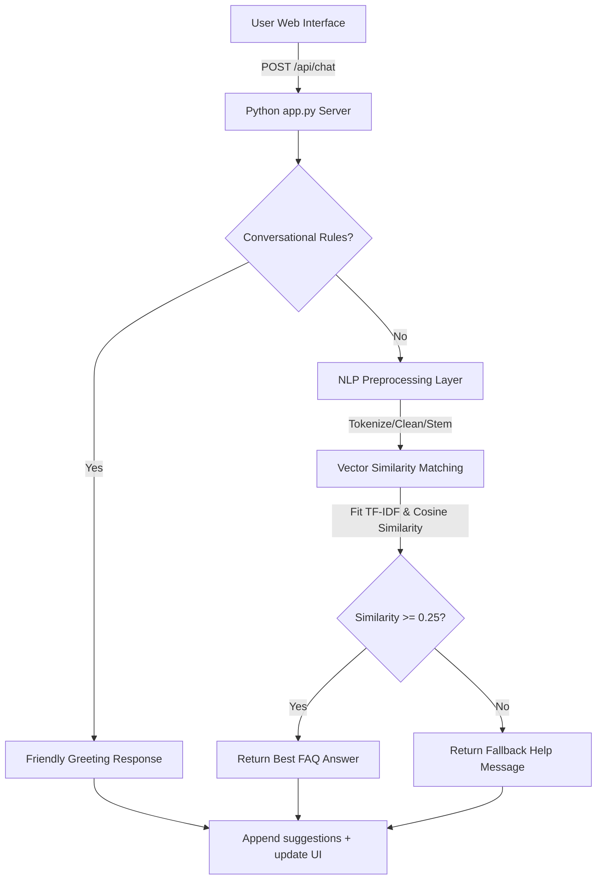

# CodeAlpha FAQ Chatbot (Aura Smart Home Support Assistant)

This project is a fully-featured, AI-powered FAQ Chatbot that matches user questions with documentation answers using Natural Language Processing (NLP) techniques and cosine similarity. 

This project was developed as part of the **CodeAlpha Artificial Intelligence Internship** to demonstrate Natural Language Processing (NLP), intelligent question answering, and information retrieval using TF-IDF vectorization and cosine similarity.

While pre-configured for a **Smart Home Product Support** domain (specifically, the fictitious **Aura Home Intelligence** ecosystem), the underlying engine is **generic** and can easily be customized to serve any domain (e.g., e-commerce, education, healthcare) by simply editing a JSON file.

---

## 🚀 Key Features

*   **Conversational Intent Layer**: Instantly intercepts common greetings (*hello, hi*), gratitude (*thanks, thank you*), identity checks (*who are you*), help commands, and exits to provide a natural, human-like chat flow before running document searches.
*   **NLP Similarity Matching Engine**: Leverages `scikit-learn`'s `TfidfVectorizer` and `cosine_similarity` to perform term-frequency similarity matching on preprocessed queries.
*   **Dedicated FAQ Explorer Panel**: Includes a grid-based card layout that lets users browse documentation categories (*Hub Setup, Device Pairing, Automations, Troubleshooting*).
*   **Click-to-Ask Integration**: Clicking any card inside the FAQ Explorer automatically copies the question to the chat assistant, transitions view panels, and sends the query to the bot for discussion.
*   **Collapsible System Status Card**: Includes a collapsible sidebar status widget showing mock network statuses. The collapse state automatically persists in the browser's `localStorage` across refreshes.
*   **User Sign-Up & Log-In Persistence**: Features a complete, persisted authentication system. New account registrations append to a local JSON file (`users.json`) on disk, and sessions persist in browser storage.
*   **Premium Glassmorphic UI**: Beautiful dark-mode dashboard styled with custom vanilla CSS variables, Outfit/Inter typography, neon drop-shadow glows, and keyframe slide transitions.

---
## 📸 Application Preview

The following screenshot shows the AI-powered FAQ Chatbot interface, including the login system, conversational chat interface, FAQ Explorer, and Smart Home support dashboard.

<p align="center">
  
</p>

---

## 🛠️ Architecture Flow



---
## 🧠 How It Works

1. The user enters a question through the chatbot interface.
2. The backend preprocesses the query using Natural Language Processing (NLP) techniques such as tokenization, stop-word removal, and stemming.
3. The processed query is transformed into TF-IDF vectors.
4. Cosine Similarity compares the user's query with all stored FAQ questions.
5. The chatbot retrieves the most relevant answer and displays it in the conversation.
6. If no suitable match is found, the chatbot returns a helpful fallback response encouraging the user to rephrase the question.

This workflow enables fast, intelligent, and context-aware FAQ retrieval without relying on external APIs or large language models.

---

## 📂 Project Structure

```
CodeAlpha_FAQChatbot/
├── app.py                  # Python backend (serving static pages, API routes, NLP matching)
├── faqs.json               # FAQ Database (questions, answers, categories, tags)
├── users.json              # Registered user database (persisted accounts)
└── public/                 # Web UI assets
    ├── index.html          # HTML5 layout (overlays, sidebar, chat views, FAQ grid explorer)
    ├── style.css           # Vanilla CSS (variables, dark mode, glassmorphism, responsive grid)
    └── script.js           # Frontend scripts (fetch calls, authentication state, toggles)
```

---

## 💻 Tech Stack

*   **Backend**: Python 3.10+, `http.server` (built-in standard library, zero web framework overhead).
*   **Machine Learning/NLP**: `scikit-learn` (for TF-IDF feature extraction and cosine calculations).
*   **Frontend**: Vanilla HTML5, Vanilla CSS3 (Custom variables, glassmorphic layout), Vanilla JavaScript (ES6 fetch, state management).
*   **Icons**: Lucide Icons (rendered dynamically via CDN).

---

## ⚡ Setup & Installation

### 1. Prerequisites
Ensure you have Python 3.10+ installed. Install the required machine learning dependencies:
```bash
pip install scikit-learn
```
*(Note: The server will automatically download NLTK datasets like `punkt` and `stopwords` on boot. If the environment is offline or has SSL firewall blocks, the server will gracefully fail-safe to an internal custom regex-based NLP engine).*

### 2. Run the Application
Navigate to the project root folder and start the Python server:
```bash
python app.py
```
The server will boot on port `8000`. Open your browser and navigate to:
**`http://localhost:8000`**

### 3. Demo Account Credentials
You can log in immediately using the pre-seeded admin account:
*   **Username**: `admin`
*   **Password**: `password123`

Alternatively, click **"Sign Up"** to register a new account, which will automatically save to `users.json` on disk.

---

## ⚙️ Customizing the FAQ Domain

Because the engine is domain-agnostic, you can swap out the **Smart Home** topic for any other product, organization, or store. 

To change the knowledge base, edit the [faqs.json](faqs.json) file in the root folder:
```json
[
  {
    "id": 1,
    "question": "What are your business hours?",
    "answer": "We are open Monday through Friday from 9:00 AM to 6:00 PM EST.",
    "category": "General",
    "tags": ["hours", "open", "timing"]
  }
]
```
Restart the server, and the chatbot and grid browser will immediately adapt to your new questions, answers, and categories!


---

## 🚀 Future Enhancements

* Integration with Large Language Models (LLMs) for conversational AI.
* Voice input and speech synthesis.
* Multi-language FAQ support.
* Database integration (MySQL/PostgreSQL).
* Admin dashboard for managing FAQs.
* User analytics and conversation history.
* Cloud deployment with Docker and CI/CD.

---

## 👩‍💻 Author

**Deepa Chaudhary**

**Artificial Intelligence Internship – CodeAlpha**

Developed as part of the CodeAlpha AI Internship Program to demonstrate Natural Language Processing (NLP), information retrieval, and intelligent FAQ answering using TF-IDF vectorization and cosine similarity.
